# AlephBFT Consensus Mechanism Explained

AlephBFT is an asynchronous Byzantine Fault Tolerant consensus protocol that orders arbitrary messages through a DAG (Directed Acyclic Graph) structure. This document provides a comprehensive explanation with visual diagrams.

## Overview

AlephBFT allows N nodes to agree on an ordering of data items, tolerating up to f = ⌊(N-1)/3⌋ malicious nodes. The protocol is asynchronous, meaning it doesn't rely on timing assumptions for safety.

## 1. High-Level Architecture

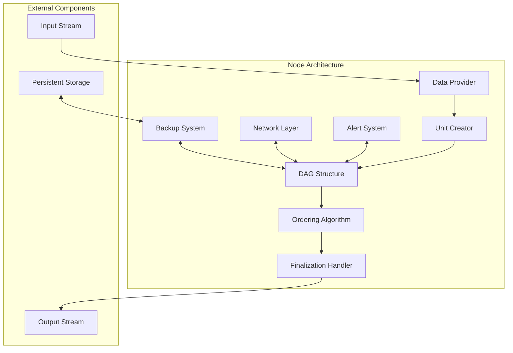

## 2. Unit Structure and DAG Construction

### Unit Components

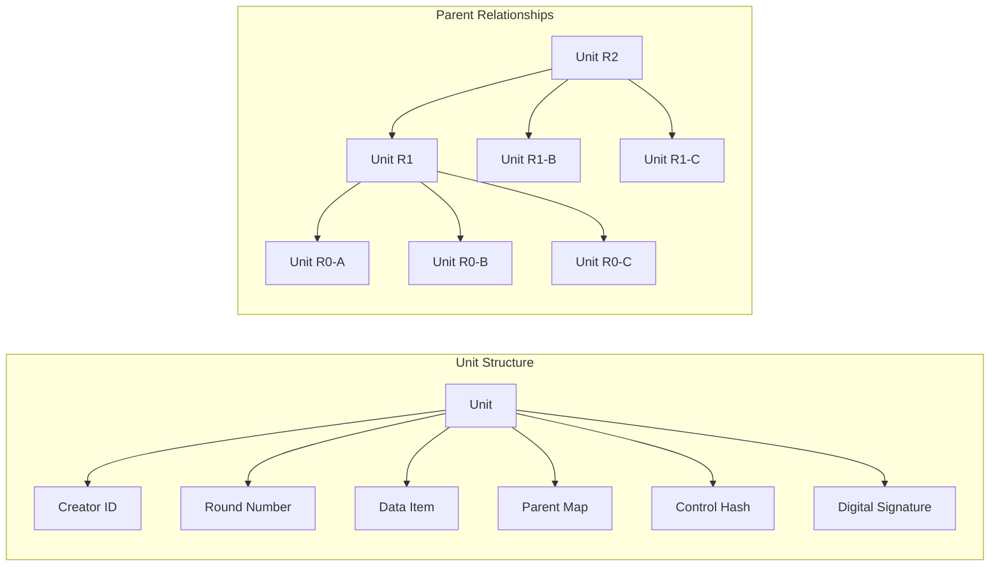

### DAG Growth Pattern

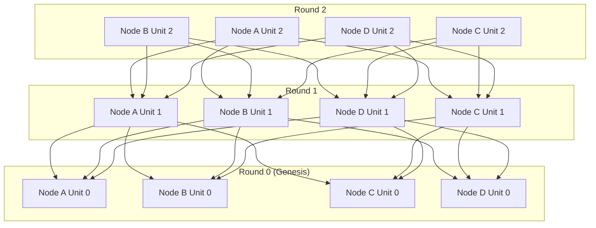

## 3. Unit Creation Rules

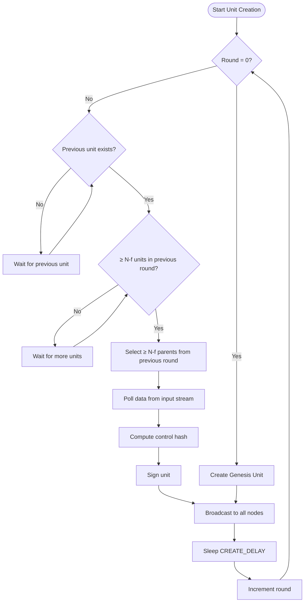

## 4. Consensus Algorithm Flow

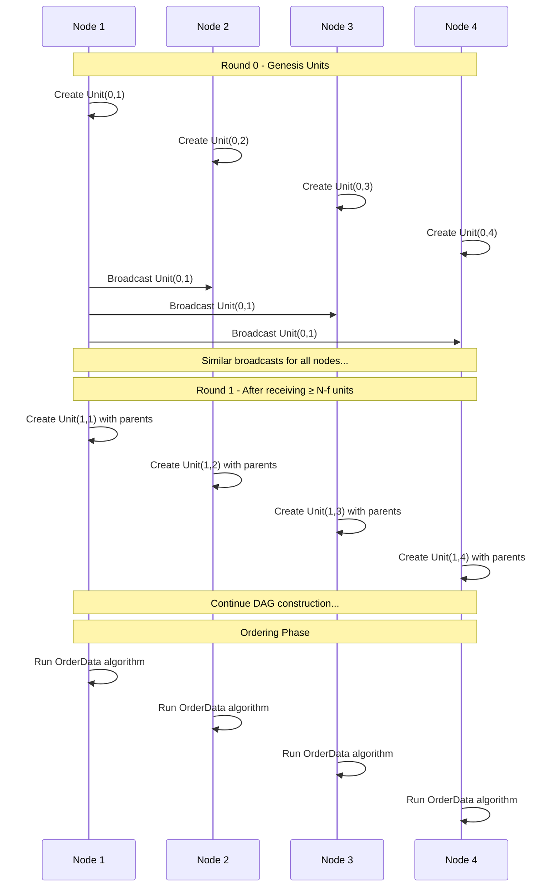

## 5. Ordering Algorithm (Head Selection)

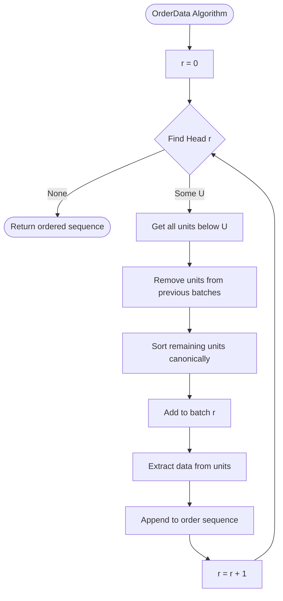

### Head Selection Process

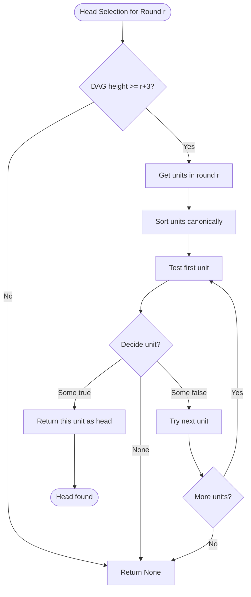

## 6. Virtual Voting Mechanism

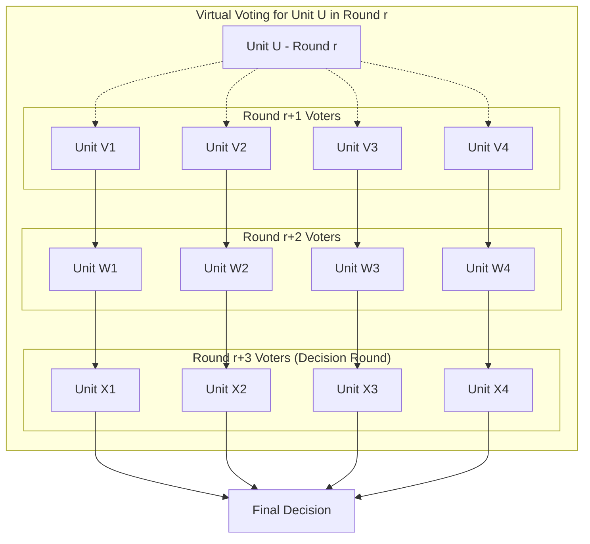

### Voting Rules

```mermaid
flowchart TD
    StartVote([Vote(U, V)]) --> CheckDiff{round_diff = V.round - U.round}
    
    CheckDiff -->|= 1| DirectParent{U ∈ parents(V)?}
    DirectParent -->|Yes| ReturnTrue[Return true]
    DirectParent -->|No| ReturnFalse[Return false]
    
    CheckDiff -->|> 1| GetParentVotes[Get votes from parents(V)]
    GetParentVotes --> AllSame{All votes same?}
    
    AllSame -->|Yes| ReturnVote[Return that vote]
    AllSame -->|No| CommonVote[Return CommonVote(round_diff)]
    
    CommonVote --> CheckRoundDiff{round_diff ≤ 4?}
    CheckRoundDiff -->|Yes, = 3| ReturnFalse
    CheckRoundDiff -->|Yes, ≠ 3| ReturnTrue
    CheckRoundDiff -->|No| ReturnParity[Return (round_diff % 2) == 1]
```

## 7. Fork Detection and Alert System

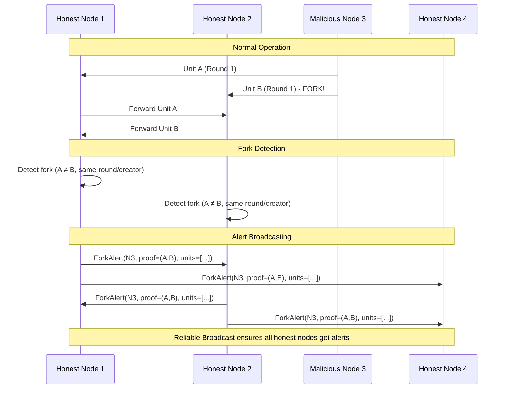

### Alert Processing

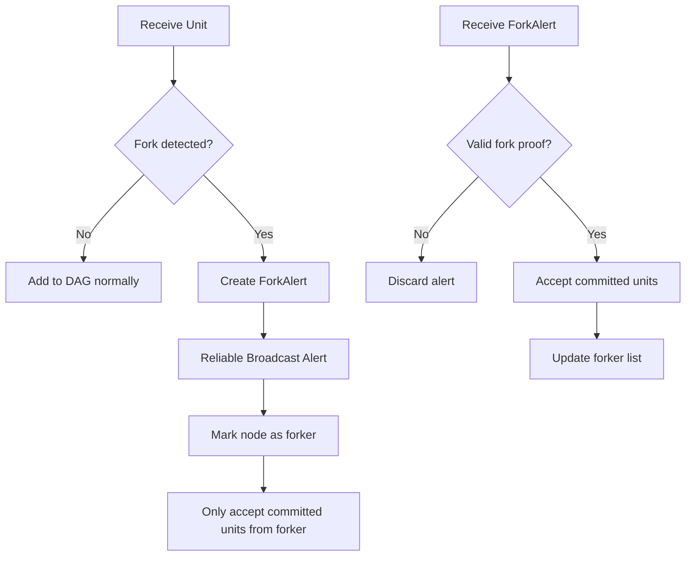

## 8. Complete Protocol Flow

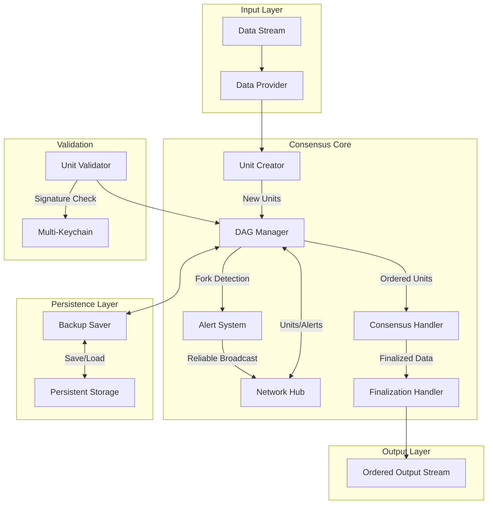

## Key Properties

### Safety Properties
- **Consistency**: All honest nodes produce the same ordering (one is prefix of another)
- **Validity**: Only data from honest nodes appears in output
- **Integrity**: No data corruption or unauthorized modifications

### Liveness Properties  
- **Termination**: Protocol continues to make progress
- **Fairness**: All honest nodes' data eventually gets ordered

### Byzantine Fault Tolerance
- Tolerates up to f = ⌊(N-1)/3⌋ malicious nodes
- Handles various attack scenarios including fork bombs
- Asynchronous safety (no timing assumptions needed for correctness)

## Implementation Highlights

1. **Asynchronous Design**: No reliance on synchronized clocks or timing assumptions
2. **DAG-based Structure**: Efficient parallel processing of units
3. **Virtual Voting**: Deterministic decision making without explicit voting rounds  
4. **Fork Resilience**: Robust handling of malicious behavior through alert system
5. **Crash Recovery**: Persistent storage enables recovery from failures
6. **Modular Architecture**: Clean separation of concerns with well-defined interfaces

This consensus mechanism provides a robust foundation for blockchain and distributed systems requiring strong consistency guarantees in adversarial environments.
